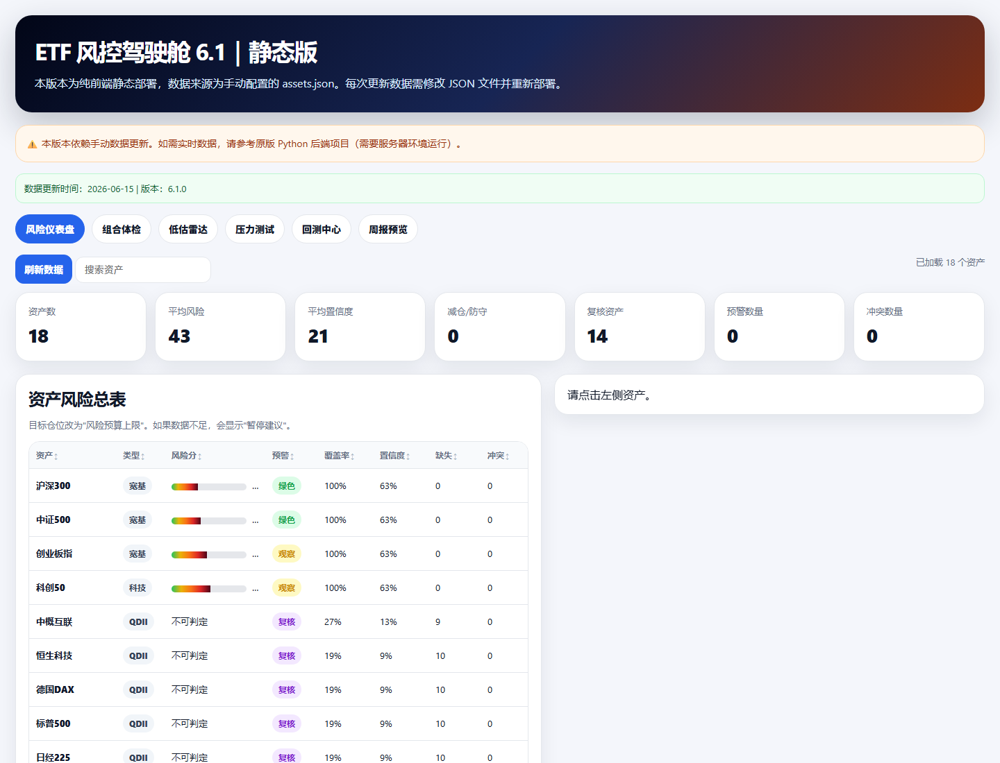
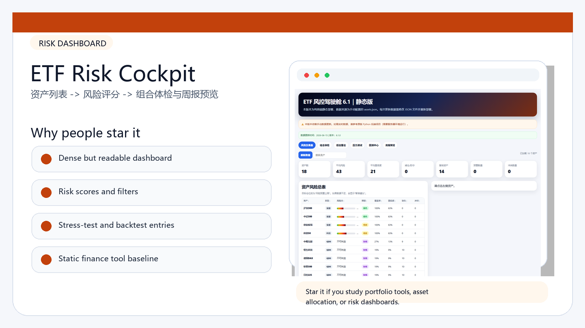
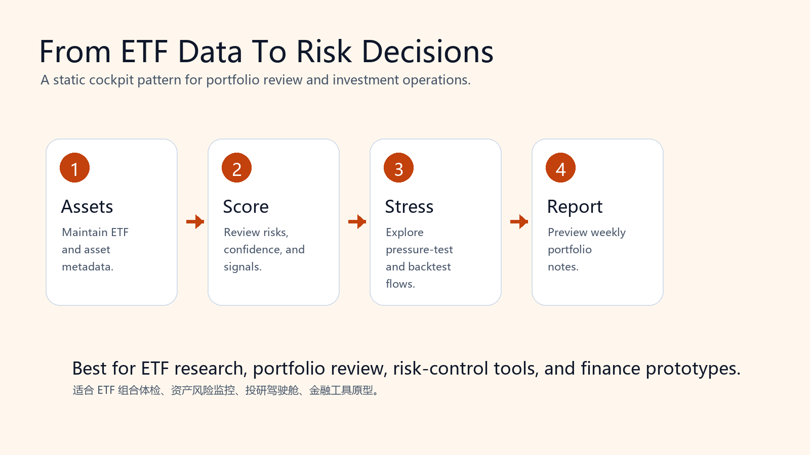

# OpenClaw ETF Risk Cockpit | ETF 风控驾驶舱

A static ETF risk cockpit for portfolio review, risk scoring, stress testing, backtest entry points, and weekly report previews.

一个纯前端 ETF 风控驾驶舱：把资产风险评分、组合体检、低估雷达、压力测试、回测入口和周报预览放进同一个界面。

## Visual Tour | 图像导览

| Product Highlights | Build / Remix Flow |
|---|---|
|  |  |

## Why Star This | 为什么值得 Star

- Shows how to design a dense but readable investment operations dashboard.
- Pure static deployment: no server required for the demo baseline.
- Good reference for risk tables, portfolio workflows, scorecards, filters, and report previews.
- 对投研工具、基金组合管理、资产配置学习项目都很容易改造。

## What Is Inside | 项目内容

- `index.html`: full static cockpit interface.
- `assets_data.js`: manually maintained asset data baseline.
- `docs/screenshot.png`: repository preview image.

## Best Use Cases | 适合做什么

- ETF portfolio review
- Risk-control dashboards
- Investment research prototypes
- Static finance tools
- ETF 组合体检、资产风险监控、投研驾驶舱、金融工具原型

## Quick Start | 快速开始

Open `index.html` directly in a browser, or deploy the folder to any static hosting platform.

## Public Safety | 公开安全说明

Private deployment URLs, tokens, local state, and hosting identifiers were removed before publication.
