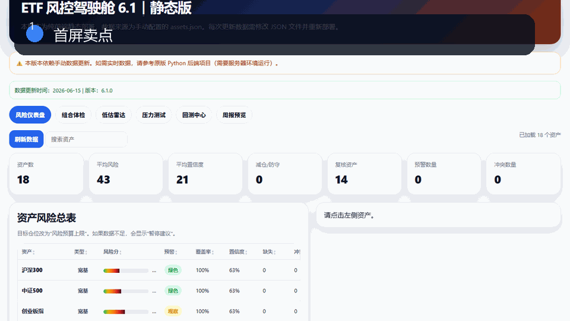
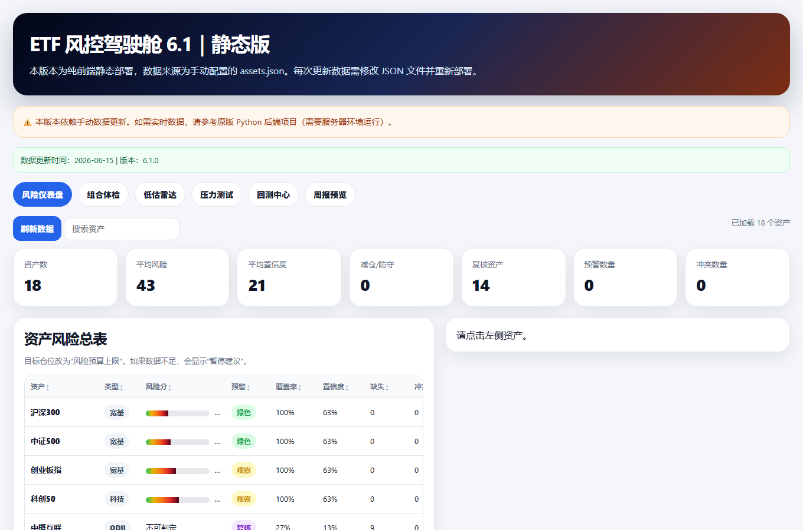
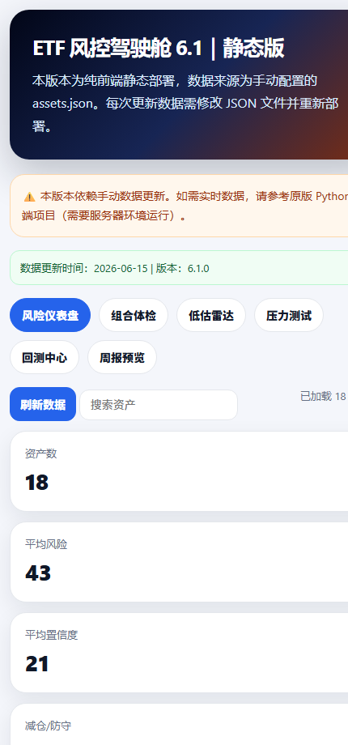
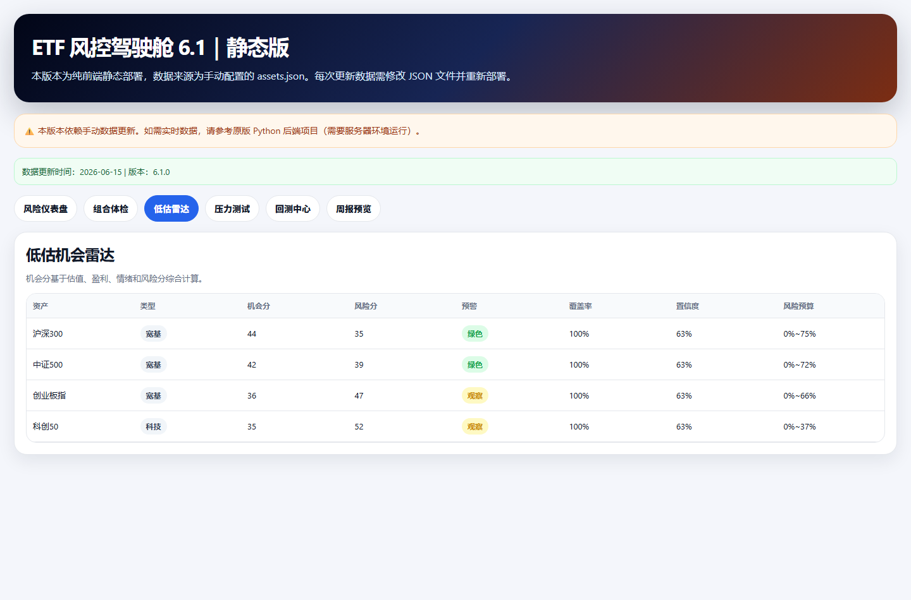
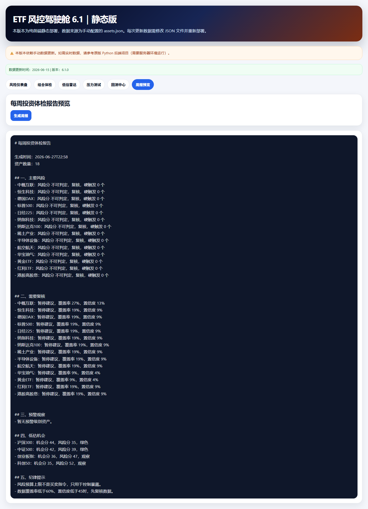

# OpenClaw ETF Risk Cockpit

A static ETF portfolio risk cockpit for scorecards, portfolio review, undervaluation radar, stress testing, backtest entry points, data status, and report previews.

**中文介绍:** [README.md](README.md)

## At A Glance

**A static ETF portfolio risk cockpit for scorecards, radar views, stress tests, and reports.**

- Includes risk scoring, portfolio review, undervaluation radar, stress testing, backtest entry points, and weekly reports.
- Dense investment information is organized into a scannable cockpit UI.
- Pure static files make it easy to deploy, study, and remix.

## Fork It In 30 Seconds

Fork it, edit `assets_data.js`, and build your own ETF watchlist, risk dashboard, or report tool.

> If this saves you from rebuilding the same product skeleton later, consider starring the repo.

## Screenshots

The four screenshots below come from the actual rendered Chinese pages in this repository: the opening screen, the scrolled second screen, and two additional feature-focused views. They are real UI captures, not concept art or English placeholder mockups.

| Opening Screen | Scrolled Screen |
|---|---|
|  |  |
|  |  |

## What This System Does

This project is a static investment-operations dashboard for ETF portfolio review. It organizes asset risk scores, confidence levels, target-position logic, warnings, portfolio import, stress testing, backtest entry points, and weekly report previews into one interface.

## Core Features

- **Risk dashboard summary** for asset count, average risk, confidence, defensive assets, review assets, warnings, and conflicts.
- **Asset risk table** with ETF name, type, risk score, confidence, target position, signal, warnings, and notes.
- **Search and sorting** for quickly browsing assets and comparing signals.
- **Asset detail panel** for explanations, metrics, warnings, and risk interpretation.
- **Portfolio checkup workflow** for importing holdings and reviewing allocation risk.
- **Undervaluation radar** as a workflow entry for identifying assets worth attention.
- **Stress-test section** for market-scenario review.
- **Backtest center** as an entry point for historical strategy validation.
- **Weekly report preview** for turning dashboard state into a readable investment note.
- **Data-status panel** for version, update time, source status, and manual update reminders.
- **Pure static deployment** with `index.html` and `assets_data.js`.

## Good Fit For

- ETF portfolio review tools
- Asset-allocation risk dashboards
- Fund research cockpits
- Investment report prototypes
- Finance education demos

## Repository Structure

- `index.html`: full static risk cockpit interface.
- `assets_data.js`: manually maintained sample asset data.
- `docs/`: screenshots and GitHub preview assets.

## Quick Start

Open `index.html` directly in a browser, or deploy the folder to any static hosting platform.

## Public-Safe Version

Private deployment URLs, production credentials, Cloudflare tokens, local environment files, logs, `.wrangler`, `node_modules`, and non-public material were removed before publication.

## Why Star This

Star this repository if you want a practical product pattern that can be studied, forked, customized, and turned into your own dashboard, content system, knowledge portal, or interactive tool.
